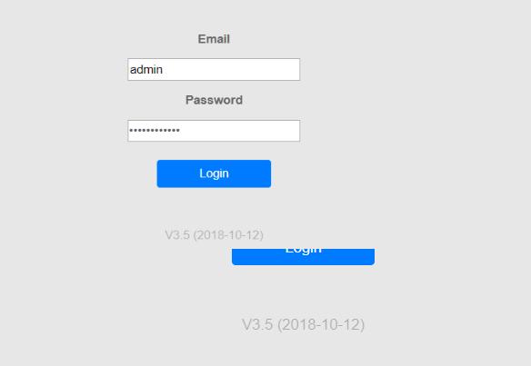

# [How can i set up high dpi on cefpython running on python3 without display bugs?](https://stackoverflow.com/questions/57498396/how-can-i-set-up-high-dpi-on-cefpython-running-on-python3-without-display-bugs)

Source: https://stackoverflow.com/questions/57498396/how-can-i-set-up-high-dpi-on-cefpython-running-on-python3-without-display-bugs

[Ask Question](https://stackoverflow.com/questions/ask)

Asked 2 years, 5 months ago

Active [2 years, 5 months ago](https://stackoverflow.com/questions/57498396/how-can-i-set-up-high-dpi-on-cefpython-running-on-python3-without-display-bugs?lastactivity)

Viewed 480 times


1


I have a code that used to run fine on python2. This code is a cefpython browser very similar to wxpython example located on git repository of cefpython. Now i moved to python3 and I am facing display bugs like the one of this picture:

[](https://i.stack.imgur.com/p6Ars.png)

The code regarding dpi is the following:

```py
def main():
   ...
     if WINDOWS:
        # noinspection PyUnresolvedReferences, PyArgumentList
        cef.DpiAware.EnableHighDpiSupport()
    cef.Initialize(settings=settings)

class MainFrame(wx.Frame):
     def __init__(self):
        wx.Frame.__init__(self, parent=None, id=wx.ID_ANY,
                      title='', size=(WIDTH, HEIGHT))
        self.browser = None

      ...
      global g_count_windows
      g_count_windows += 1

      if WINDOWS:
          # noinspection PyUnresolvedReferences, PyArgumentList
          print("[wxpython.py] System DPI settings: %s"
             % str(cef.DpiAware.GetSystemDpi()))
       if hasattr(wx, "GetDisplayPPI"):
          print("[wxpython.py] wx.GetDisplayPPI = %s" % wx.GetDisplayPPI())
       print("[wxpython.py] wx.GetDisplaySize = %s" % wx.GetDisplaySize())

       print("[wxpython.py] MainFrame declared size: %s"
          % str((WIDTH, HEIGHT)))
       size = scale_window_size_for_high_dpi(WIDTH, HEIGHT)
       print("[wxpython.py] MainFrame DPI scaled size: %s" % str(size))

    wx.Frame.__init__(self, parent=None, id=wx.ID_ANY,
                      title='wxPython example', size=size)

    print("[wxpython.py] MainFrame actual size: %s" % self.GetSize())
```

And the output prints related to dpi and versions are:

```py
[wxpython.py] CEF Python 66.0
[wxpython.py] Python 3.7.3 32bit
[wxpython.py] wxPython 4.0.6 msw (phoenix) wxWidgets 3.0.5
[wxpython.py] System DPI settings: (120, 120)
[wxpython.py] wx.GetDisplayPPI = (157, 158)
[wxpython.py] wx.GetDisplaySize = (1920, 1080)
[wxpython.py] MainFrame declared size: (800, 600)
[wxpython.py] MainFrame DPI scaled size: (1000, 750)
```

How can I run this example on python3?

Thank you for any further help. Ricardo

[python-3.x](https://stackoverflow.com/questions/tagged/python-3.x)[dpi](https://stackoverflow.com/questions/tagged/dpi)[chromium-embedded](https://stackoverflow.com/questions/tagged/chromium-embedded)[highdpi](https://stackoverflow.com/questions/tagged/highdpi)[cefpython](https://stackoverflow.com/questions/tagged/cefpython)

[Share](https://stackoverflow.com/q/57498396)

Follow

asked Aug 14 '19 at 16:08

[](https://stackoverflow.com/users/9653420/ricardo-goncalves)

[Ricardo Goncalves](https://stackoverflow.com/users/9653420/ricardo-goncalves)

**295**33 silver badges1515 bronze badges

- 1

  See this comment: [github.com/cztomczak/cefpython/issues/…](https://github.com/cztomczak/cefpython/issues/530#issuecomment-505066492) 

- I had a similar problem with python2 and this solution did not work. But now, with python3, this solution worked for me: cef.Initialize(settings={}, switches={'disable-gpu-compositing': None}) . Thank you a lot! 

[Add a comment](https://stackoverflow.com/questions/57498396/how-can-i-set-up-high-dpi-on-cefpython-running-on-python3-without-display-bugs#)


## 1 Answer

[Active](https://stackoverflow.com/questions/57498396/how-can-i-set-up-high-dpi-on-cefpython-running-on-python3-without-display-bugs?answertab=active#tab-top)[Oldest](https://stackoverflow.com/questions/57498396/how-can-i-set-up-high-dpi-on-cefpython-running-on-python3-without-display-bugs?answertab=oldest#tab-top)[Votes](https://stackoverflow.com/questions/57498396/how-can-i-set-up-high-dpi-on-cefpython-running-on-python3-without-display-bugs?answertab=votes#tab-top)


0


The solution to my problem was pointed by Czarek Tomczak on a comment to my question: https://github.com/cztomczak/cefpython/issues/530#issuecomment-505066492

Adding the parameter {'disable-gpu': ''} to the switches solved my problem.

```py
cef.Initialize(settings={}, switches={'disable-gpu': ""})
```

On the thread available on the link, it says that this is not the right solution. It worked for me, and I am not having problems until now. But if anyone knows another solution I can try it.


[Share](https://stackoverflow.com/a/57552491)

Follow

answered Aug 19 '19 at 7:50

[](https://stackoverflow.com/users/9653420/ricardo-goncalves)

[Ricardo Goncalves](https://stackoverflow.com/users/9653420/ricardo-goncalves)

**295**33 silver badges1515 bronze badges

- You have to attach High DPI manifest for both main executable and subprocess executable. Disabling GPU is not recommended, you may just be lucky that it works due to faster startup timing on your machine. 
- Well, I am sorry if my doubts are basic, but I have some questions regarding your comment: (1) What is a High DPI manifest? It is like a config file? Can you give me an example? (2) When you say main executable, are you assuming that i am bundling a cef python script with pyinstaller? (3) To attach a manifest, do I only need to place the manifest on the same path of the executables you've mentioned? 

[Add a comment](https://stackoverflow.com/questions/57498396/how-can-i-set-up-high-dpi-on-cefpython-running-on-python3-without-display-bugs#)